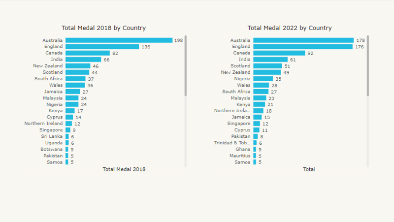
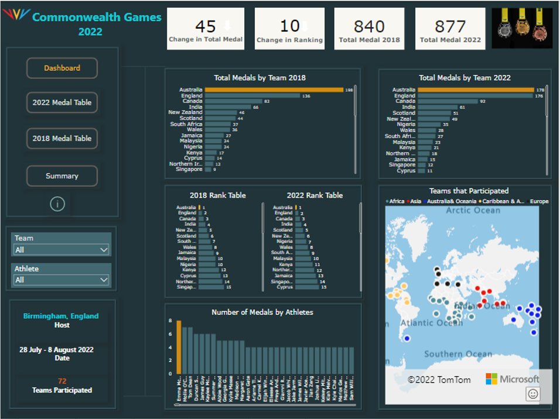

# Commonwealth-Games-2022
---
Title: "Commonwealth Games 2022"

Author: "Millicent Ofobuike"

Date: '2022-09-17'

---


## Introduction

I started learning PowerBi on DataCamp.com around the time the Commonwealth Games 2022 hosted by Birmingham UK started. It started on July 28 and ended on August 8th 2022. I decided to do this project to test the knowledge of PowerBi I have acquired so far. 
Commonwealth Games is a sports competition in which only the Commonwealth of Nations and their territories are eligible to participate. Commonwealth of Nations are a group of sovereign nations which were former colonies of the British Empire. A total of 72 countries participated in 2022 Commonwealth Games.  

I downloaded the 2022 result datasets from Kaggle.com, for quality issues I compared it to the data in the Birmingham2022 website.

I thought it would be nice to see:
*	Which team had the most medals.
*	Which team topped the rank.
*	The most decorated athlete.
*	Which teams participated.
*	How the teams performed generally compared to 2018.

## **PROJECT METHODOLOGY**
The steps of the project can be summarized as follows:
## Prepare
The dataset used for the analysis were gotten from 

 <https://www.kaggle.com/datasets/ramjasmaurya/commonwealth-games-2022>,


<https://www.kaggle.com/datasets/varunnagpalspyz/commonwealth-games-2022>,


<https://www.kaggle.com/datasets/gauravtopre/birmingham-commonwealth-games-2022>,

<https://results.gc2018.com/en/all-sports/medal-standings.htm>.

Microsoft Excel and PowerBi were chosen for data cleaning and analysis.
I downloaded all the files I needed and saved the files in excel.

## Process
I assessed the dataframes looking out for duplicates, missing data, incorrect data types. I renamed the columns to be understandable for instance medal to medal type, abbreviations were changed for example S to silver, G to gold, B to bronze using the find and replace.
I used the countifs function to get the number of Gold, Silver and Bronze medals won by each athlete. I used advanced filter in data tools to filter unique names to get unique athlete names from the medalists' dataframe. I used flash fill to split first name and last names of the athletes. Here is one of the quality issues I encountered.


Here I renamed the worksheet then inserted a new column and wrote how I wanted the names to appear in the first cell then used Ctrl + E or flash fill to fill down.

## Analysis
 I imported the dataset into Microsoft PowerBi and clicked on transform. I removed the extra columns that were created and renamed the column names appropriately.
In PowerBi, I created new columns and new measures using DAX.I created 2018 Ranking, 2022 Ranking, Change in Total Medal and Change in Ranking.
I created an arrow in Ms Powerpoint and saved it as a picture. I downloaded Image Pro by CloudScope in more visuals in PowerBi. I changed the arrow image to base64 and then visualized it with Image Pro.

#### How the Countries Performed


#### Observation
Australia had the highest number of medals (178 medals), followed closely by England's 176 total medals. In the third place is Canada with 92 medals followed by India with 61 medals.

#### How the Athletes Performed


#### Observation
Emma Mckeon is the most decorated athlete. She won a total of 8 medals(6 gold, 1 silver and 1 bronze medals). Mollie O'Callaghan and Tom Dean won 7 medals each while Duncan Scott, James Guy, Kaylee McKeon, Summer Mckintosh followed behind with a total of 6 medals each.

#### Country Performance 2022 vs 2018




#### Observation
Australia, England, Canada and India maintained their ranks in 2018. New Zealand went down by 1 in ranking while Scotland went up the table by 1. Nigeria moved up the table from 10th to 7th while South Africa moved down the table by 2. Looking at the rank tables you will notice lots of upward and downward movements by the countries.

To make this easy to see, I created an interactive report where you can select each country and see the total medals they got in 2018 vs 2022, change in total medals and change in ranking.




I used colours and arrows to show positive and negative movements. Here green arrow pointing upwards represents an upward movement in rank table and an increase in total medal. Red arrow pointing downwards represents a downward movement in rank table and a decrease in total medal.

To see more

<iframe width="560" height="315" src="https://www.youtube.com/embed/qBEbJxu61CM" title="YouTube video player" frameborder="0" allow="accelerometer; autoplay; clipboard-write; encrypted-media; gyroscope; picture-in-picture" allowfullscreen></iframe>

## Summary

* England had a total of 176 medals which is a very close one compared to Australia's 178 total medals. Australia's total medals dropped by 20 while England's total medals increased a by 40.
* Across all 43 teams that won at least a medal, total medal in 2022 ranged from 1 to 178.
* Australia topped the rank table with 198 total medals in 2018 and 178 total medals in 2022.
* Emma McKeon is the most decorated athlete with a total of 8 medals.
* Total medals gotten by all teams in 2018 is 840 while the total medals gotten by all teams in 2022 is 877 which is an increase by 37.


###### codes used in attaching the arrows
```{}
arrow ranking = if(comparison[Change in Ranking] > 0, [up arrow], if(comparison[Change in Ranking] < 0, [down arrow], "data:image/png;base64,
iVBORw0KGgoAAAANSUhEUgAAAGAAAAB+CAMAAAGbndR3AAAAAXNSR0IArs4c6QAAAARnQU1BAACxjwv8YQUAAAAnUExURQAAAP///////////////////////////////////////////////649SjkAAAAMdFJOUwAWF0BggMrLzM3P7w1CQSwAAAAJcEhZcwAAFxEAABcRAcom8z8AAAKKSURBVFhH7ZjhetowDEUDWynd9v7Pu0g6gGzHsRwSunY+f2pd3SuV8LWQTDNvfwQ5fU6hJ8NXvqdnKs5acRIS/dF6fWEn5eqq+Xyv9Ez1bmet7ue5cuf5av16gGTYZTSQjO/QoE7wl86BLKAoyUV8tDJZqMjChZ8OnQJIBu+RgmRgVpAMNAXJQFOQDDQFyUBTkAw0BclAU5AMNAXJQFOQDDQFyUBTkAw0BclAU5AMNAXJQFOQDDQFyUBTkAw0BelMmVHr1DKqL3TQiw6qkHTQDNdBuXHvUD+gQ+XRDueUucMp58zPEv9H7aFd8oLA72Vol/yLrwFDDu2SEXDQLvlvAifEIPLx5/7LtLh9Egcj7oM7EvF2oRHJ7cJKZMkuVCKV7wvKQmTNLmSRll1wkYhdIBK1C3Nk4TtQgQ0ueKNdgiGnHuCLVc6OGzDkfGaAT6ic7/2iMeSMQAKGnBFIwJAzAgkYckYgAUPOqwMX1CCnafrgGEJv6a4UAbgFDCfm38cIJu7+YML5Q4nEH0hk/mai8DcSC/7VxKJ/JVHxVxNVfyWx4p+md0yOVf9CouEvEk1/lgj4k0TI7xJB/z0R9pPo8Guiyz8nOv31+9IK9f+ONQ5f8LMTYnG+/iU6fMGPTojFGe9Bk7GgyVjQZCxoMhY0GQuajAVNxoImY0GTsaDJF1pw6npc1seH3T2fD1px5WHczHn1IdM2rum9/94rsvHCnisWxgt7raiMF/ZYsTJeeHZFY7zwzIrAeGHriuB4YcuKzmdevSv6H6l1rdgwXji7Z5xrbBwvRFY8MV5orXhyvLC2YofxQm3FTuOFpRU7jhfyFTuPF/yKA8YLtxUHjRdkxeW48cKpb/w0/QWq7BBVU+QawgAAAABJRU5ErkJggg=="))
# here i used the if() to show the direction that the arrow should point to if the ranking is greater or less than 0
```

## 

```{}
arrow total medal = if(comparison[Change in Total Medal] > 0, [up arrow], if(comparison[Change in Total Medal] < 0, [down arrow], "data:image/png;base64,
iVBORw0KGgoAAAANSUhEUgAAAGAAAAB+CAMAAAGbndR3AAAAAXNSR0IArs4c6QAAAARnQU1BAACxjwv8YQUAAAAnUExURQAAAP///////////////////////////////////////////////649SjkAAAAMdFJOUwAWF0BggMrLzM3P7w1CQSwAAAAJcEhZcwAAFxEAABcRAcom8z8AAAKKSURBVFhH7ZjhetowDEUDWynd9v7Pu0g6gGzHsRwSunY+f2pd3SuV8LWQTDNvfwQ5fU6hJ8NXvqdnKs5acRIS/dF6fWEn5eqq+Xyv9Ez1bmet7ue5cuf5av16gGTYZTSQjO/QoE7wl86BLKAoyUV8tDJZqMjChZ8OnQJIBu+RgmRgVpAMNAXJQFOQDDQFyUBTkAw0BclAU5AMNAXJQFOQDDQFyUBTkAw0BclAU5AMNAXJQFOQDDQFyUBTkAw0BelMmVHr1DKqL3TQiw6qkHTQDNdBuXHvUD+gQ+XRDueUucMp58zPEv9H7aFd8oLA72Vol/yLrwFDDu2SEXDQLvlvAifEIPLx5/7LtLh9Egcj7oM7EvF2oRHJ7cJKZMkuVCKV7wvKQmTNLmSRll1wkYhdIBK1C3Nk4TtQgQ0ueKNdgiGnHuCLVc6OGzDkfGaAT6ic7/2iMeSMQAKGnBFIwJAzAgkYckYgAUPOqwMX1CCnafrgGEJv6a4UAbgFDCfm38cIJu7+YML5Q4nEH0hk/mai8DcSC/7VxKJ/JVHxVxNVfyWx4p+md0yOVf9CouEvEk1/lgj4k0TI7xJB/z0R9pPo8Guiyz8nOv31+9IK9f+ONQ5f8LMTYnG+/iU6fMGPTojFGe9Bk7GgyVjQZCxoMhY0GQuajAVNxoImY0GTsaDJF1pw6npc1seH3T2fD1px5WHczHn1IdM2rum9/94rsvHCnisWxgt7raiMF/ZYsTJeeHZFY7zwzIrAeGHriuB4YcuKzmdevSv6H6l1rdgwXji7Z5xrbBwvRFY8MV5orXhyvLC2YofxQm3FTuOFpRU7jhfyFTuPF/yKA8YLtxUHjRdkxeW48cKpb/w0/QWq7BBVU+QawgAAAABJRU5ErkJggg=="))

```

```
{conditional format table = 
SWITCH(TRUE(),
    SELECTEDVALUE(comparison[Change in Total Medal]) < 0, "Red",
    SELECTEDVALUE(comparison[Change in Total Medal]) > 0, "#378805", 
    "Black"
)
conditional formatting color = 
SWITCH(TRUE(),
    SELECTEDVALUE(comparison[Change in Ranking]) < 0, "Red",
    SELECTEDVALUE(comparison[Change in Ranking]) > 0, "#378805", 
    "Black"
)
}

```
```
{down arrow = "data:image/png;base64,iVBORw0KGgoAAAANSUhEUgAAAGAAAAB/CAMAAAFQwQfSAAAAAXNSR0IArs4c6QAAAARnQU1BAACxjwv8YQUAAABjUExURQAAAC5Riy5RlyxOkDBQjzBSjy5SjS9Sjy5Sji5SjzBSjjBSjzBRjzFRjzFRji9Tjy9Sjy9Sj0lIfVZCdVZDdFpBcVpBcmM9a30zWYMxVIQwVZAsS5cpR9gPG+0HDfIFCf8AAIoK090AAAARdFJOUwAWFhdAYIDKy8vLy8zMzc/vw1qXPAAAAAlwSFlzAAAXEQAAFxEByibzPwAAAuJJREFUWEftmel2mzAQhZWQ2nGw3ZLY7hKX9P2fsrrSgEcw2rBoT87R9yea5c4F4YAXpdl0ACsEf8AQfIAhcCoFA21uAnsQZglMja8porWJaAVua3M6w/kYyVAzpzOcj1MpGGhvG5iDONu1jlCjiA7ORMOBIhrXOmJrvVtfb1DKYq+dhVIWu78WSlk+UWHcOwbfOgbfOUoBd0/G0iQNUBLSQEjTjhsoZaFrZKCU5WqdgaugKQZKWd7tqxW4Be+oWtCsUDiai8MLhkelDpTg9DovVWx+XhnySu0pY7nl3QrP84qbV6r15IfKPG8rUh4VOa/UzpPX/9S/fku4+83hdzMOleds2EVhBATfZKg8J9+hCkaqwOHzCo7So1ik7xorOSRJetxFB+ISpx3sg5JZO/BLxHYgS7ztoJ1Jgu3AlUTbwU2S1A6sJLkdtOesdvBAf4PQ3X3KhspzOnqCuPz0C+id2JSAg0xAYHZ/yrWkQMYvoEfalIADvc10ef+vJ00tLlXgUgUjVeBSBSNV4JIkeKTHjIFaXK5UBEetaLqeKlHOB+ORrKD+ZMXYn6hg/UkKpz9BMemPKi576rsRVAj9QYXYH1BcWuqY4lF4+z2KQL+oCPYLikj/TBHtnyguL5QNwRRJ/UyR2D8qLs8UxzGKjH6jyOqHYkurVJI+Pjj4vjry4L87+ljd4EsmJEtn051+JHNatEXytwki10UGr9+TeV1g8JQJydL5By/T1a9BNYhQDaJUgyjVIEo1iFINolSDKNUgSjWIUg1GHrb0Dn9GloGHLT4/N8fuzL6jKEV/7g70E69qDsUt+HhQ2ALjpz9lFrSQxoNCFr7xoIBFaDy40yI2HjT7xRb9pdvHxoOFFqnjwQKLnPEg00KPb3PGgwyLJeNBosXS8aBpoxb3jAcRi3vHg4CFHv9y73jgsSg1HggWJceDiYUe/1xyPGAWa4wHZLHWeNDsutNbt11rPGh2eeOV+gseNKCOCFH44gAAAABJRU5ErkJggg=="
}
```
```
{up arrow = "data:image/png;base64,iVBORw0KGgoAAAANSUhEUgAAAGAAAAB/CAMAAAFQwQfSAAAAAXNSR0IArs4c6QAAAARnQU1BAACxjwv8YQUAAABgUExURQAAAC5Riy5RlyxOkDBQjzBSjy5SjS9Sjy9SkC5SjzBSjzBTjzBTjy9Tjy9SjztjgjxlgTxkgS9SjzdehjtjgTxkgDxlgD9pfUd0dEp3ck59bVCAa2ScVGqlTWynS3CtR9iIRU8AAAASdFJOUwAWFhdAYIDKysvLy8zP7/39/lrpIfAAAAAJcEhZcwAAFxEAABcRAcom8z8AAALDSURBVFhH7ZjpdpswEIUd3ILJ0ibEcZvF5f3fsjPSBWtFIyyanB59fyrN3DvXHJZQdpob/Mt04x6r3e4wjvOup/W002u9m9botWrJq403P5hpMzDYOIxnLAiyzzs1DDu1xg7rqafXarnpRh3OdDzqcNzj6c6XE2PQ8RC/xadOYbcuZ4u4tKwyo1temZld+nxoUNL8N42PCyhJeIxciU/jGOxQPdhR9UAHda8z152OUbc6Vt3onFCYQceroxOoG9PeUSCMbKI2iH/f0A8aDUqaqEM/jTQoaV5xbxB2w6MbvAfUEh1dmme5heWM0DLJGYHl4NwnCYsrZxYsfUDORCwxOROw9C/oRXAsffBWtjEsEjkDS49riDEuNgM0FY2KmGgjBrR9quFCNVh8RcPbnxALBtwlLmj75P+khzBo+2T/JAPzPyASmqHHSkYznE/3WEsg/ThmOJQ+wwG92DHrhQ5DL3JYeoHD0Scdnj7hCOgXHUH9giOiJ8cdFDZRfcSxoA86FvUBR0JPjlsoNUm94xDoLYdIT47prhXqZ8deqoejwbNHgYbNO5qM8yyJGFq0faphphpsqmGmGmyqYeZzDXjZtnmLG/DxxGUhIcynHnSYuAFv/y4LCfgyZPNa8Celabo++BWlEE03/DwO91tF0PhHeu05n7aJoPFPeKvaIsIYz5SOcMYzJSMC45lSEZHxTImI5hAdz1wbkRjPXBMhGM+sjWh60XhmTUTGeCY3InM8QxF30ogV4xlpxMrxjCSCxr+sHM+kImj86YrxDEXcxiIKjGdiEYXGM6GIguMZirD+du/LjmfMiA3GM1PETYe3GY/wZ9kg5icLiy7++bTNC8h/2aoBSWpAkhqQpAYkqQFJakCSGpCkBiSpAUlqQJIWb/hC8gO+ZQKbnHZ4/iXm+Wueg+NvMccVAd8zgU3O5ldRmYDd7i/srI47T71kUAAAAABJRU5ErkJggg=="
}
```
